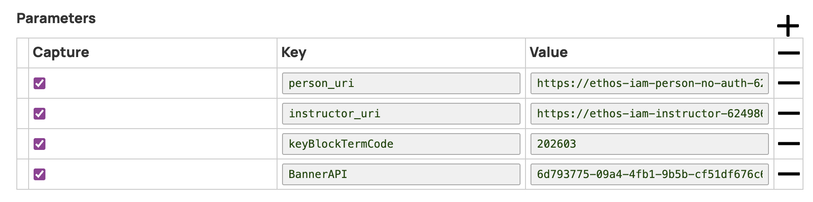

## Updating Application and Environment Variables

### Snaplogic 
>The following Pipeline Parameters are set in __Workday.NewHire-IAM.Create__.

`keyBlockTermCode`. This value should be updated for each new academic year.



[Link button](https://just-the-docs.com){: .btn .btn-purple }

```python
import antigravity
```

